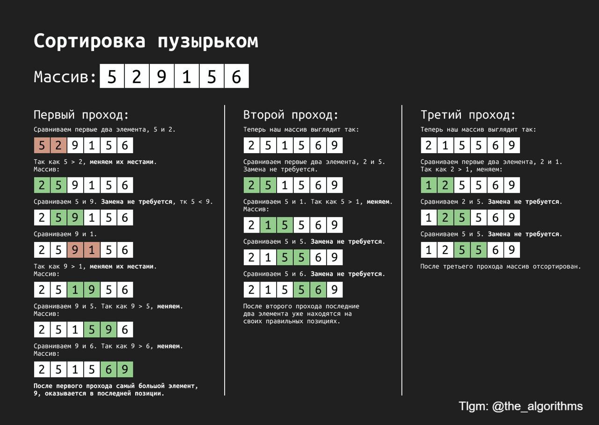

# Bubble Sort

### Idea

Iterate through a massive comparing 2 neighbour elements each time. If previous element is greater than following, swap them and continue.

This process allow to "bubble up" and to
_**correctly**_ place the greatest element on each iteration.

 

### Data Structures

- Array

 

### Complexity

<table>
    <thead>
        <tr>
            <th colspan=2>Time</th>
            <th rowspan=2>Space</th>
        </tr>
    </thead>
    <tbody>
        <tr>
            <td>Average</td>
            <td>Worst</td>
            <td rowspan=2 valign="bottom" align="center">
                <b>O(1)</b>
            </td>
        </tr>
        <tr>
            <td align="center"><b>O(n²)</b></td>
            <td align="center"><b>O(n²)</b></td>
        </tr>
    </tbody>
</table>
<!-- 
| Time       | Time       | Space    |
| ---------- | ---------- | -------- |
| Average    | Worst      |          |
| $ O(n^2) $ | $ O(n^2) $ | $ O(1) $ | -->

 

### Example

