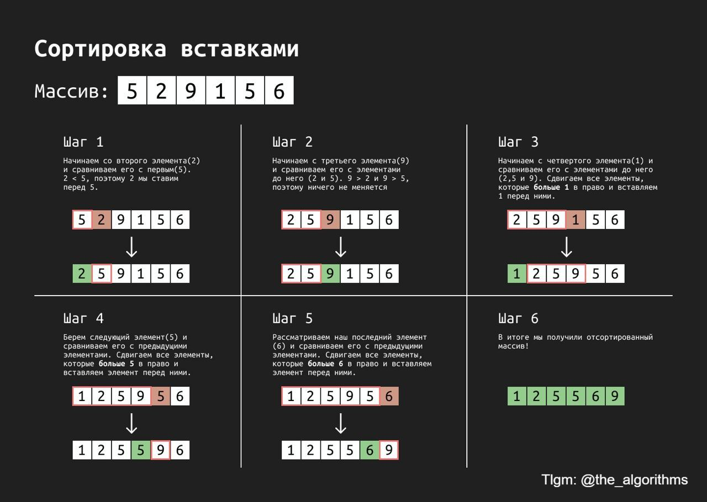

# Insertion Sort

### Idea

Iterate through unsorted part (first element is called sorted), on each step place the element on its place by inserting it to the left to the smaller values and keep on place when its greater or equal than following left elements.

### Data Structures

- Array

### Complexity

<table>
    <thead>
        <tr>
            <th colspan=2>Time</th>
            <th rowspan=2>Space</th>
        </tr>
    </thead>
    <tbody>
        <tr>
            <td>Average</td>
            <td>Worst</td>
            <td rowspan=2 valign="bottom" align="center">
                <b>O(1)</b>
            </td>
        </tr>
        <tr>
            <td align="center"><b>O(n²)</b></td>
            <td align="center"><b>O(n²)</b></td>
        </tr>
    </tbody>
</table>

### Example

