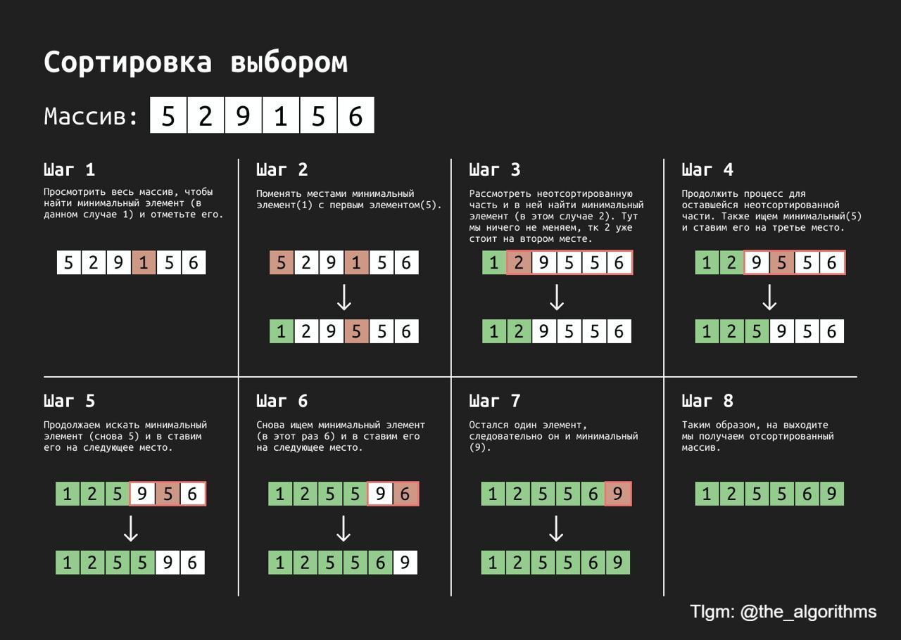

# Selection Sort

### Idea

Iterate through the whole array. On each step, interate only on unsorted part and find the minimal element. In the end, swap the minimal element with first unsorted.

### Data Structures

- Array

### Complexity

<table>
    <thead>
        <tr>
            <th colspan=2>Time</th>
            <th rowspan=2>Space</th>
        </tr>
    </thead>
    <tbody>
        <tr>
            <td>Average</td>
            <td>Worst</td>
            <td rowspan=2 valign="bottom" align="center">
                <b>O(1)</b>
            </td>
        </tr>
        <tr>
            <td align="center"><b>O(n²)</b></td>
            <td align="center"><b>O(n²)</b></td>
        </tr>
    </tbody>
</table>

### Example

